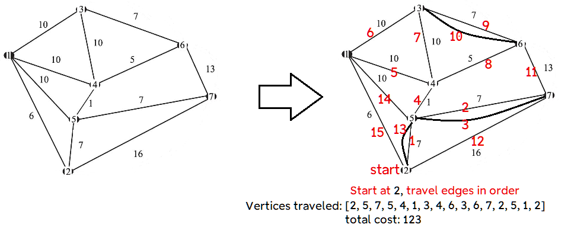

### Dart package to solve the Chinese Postman Problem for undirected graphs




```dart
Postman p = Postman();

  Map<int, Map<int, double>> graph = {
    1: {2: 6, 5: 10, 4: 10, 3: 10},
    2: {5: 7, 7: 16},
    3: {4: 10, 6: 7},
    4: {5: 1, 6: 5},
    5: {7: 7},
    6: {7: 13}
  };

  List<int> tour = p.postmanTour(graph, startingVertex: 2);
  print(tour);
  print('total cost: ${p.cost()}');
//output:
//[2, 5, 7, 5, 4, 1, 3, 4, 6, 3, 6, 7, 2, 5, 1, 2]
// total cost: 123.0
```