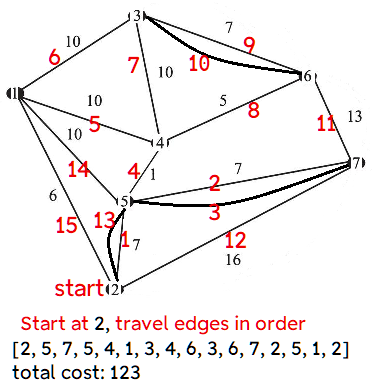

# Dart package to solve the Chinese Postman Problem for undirected, weighted graphs:

#### How to travel through each edge and return to the start in the shortest way possible


```dart
import 'package:chinese_postman/chinese_postman.dart';

void main() {
  Postman p = Postman();


  // Repeating entries in the graph will not add duplicate edges. 
  // If the original graph contains duplicate edges,
  // add new vertices with a distance of 0 from other vertices.

  Map<int, Map<int, double>> graph = {
    1: {2: 6, 5: 10, 4: 10, 3: 10},
    2: {5: 7, 7: 16},
    3: {4: 10, 6: 7},
    4: {5: 1, 6: 5},
    5: {7: 7},
    6: {7: 13},
    //This will not change the result
    //since the edges are already above
    // 7: {2: 16, 5: 7, 6: 13}
  };

  List<int> tour = p.postmanTour(graph, startingVertex: 2);

  print(tour);
  print('total cost: ${p.cost()}');
}

```

This outputs the following:

```dart
[2, 5, 7, 5, 4, 1, 3, 4, 6, 3, 6, 7, 2, 5, 1, 2]
total cost: 123.0
```

The start/end vertex is 2.

The list above shows the path to traverse each edge and return to vertex 2.

Some edges in the solution are duplicated. This is unavoidable. A more detailed explanation of how
to solve the problem is below.

## Chinese Postman Problem

Firstly, the graph must be connected (there should be a path between any 2 vertices).


The first thing to do is count how many edges meet at each vertex (called the "degree" of the
vertex).

If the degree is odd, the vertex is called an "odd vertex."

If there are no odd vertices, there is an optimal solution where no edges are repeated. This is
called an "eulerian" path.

In a connected graph, there will always be an even number of odd vertices.

For the connected example above, the odd vertices are 2, 3, 6, and 7. We have to arrange these into
pairs to minimize the distance traveled. This will then tell us which edges will need to be
repeated.

There are only 3 matchings:

1 - [2,3],[6,7]

2 - [2,6],[7,3]

3 - [2,7],[6,3]

but for more vertices, the number grows substantially. (For 16 odd vertices, there would be over 2
million matchings.)
Thus we need a more efficient algorithm to find the optimal matchings. This package uses the Edmonds
blossom algorithm.

[The Dart code was translated from repositories by
[simlu](https://github.com/simlu/EdmondsBlossom) and
[mattkrick](https://github.com/mattkrick/EdmondsBlossom), which were based on [this](http://jorisvr.nl/maximummatching.html)
Python implementation. Code was altered to find a mininum-cost instead of maximum-cost matching.]

Note: For a weighted graph like above, the length of each edge does not correspond to the length of
line drawn, so the shortest path between 2 odd vertices may not be a straight line.

For example, the shortest distance between vertices 2 and 7 is not the straight line with length 16,
but to go from vertex 2 to 5 to 7, which is 14.

[This package uses the [dijkstra](https://pub.dev/packages/dijkstra)
package to find the shortest distance between each pair of odd vertices.]

The total distance, or cost, between each pair of odd vertices is:

[2,3],[6,7] = 16 + 13 = 29

[2,6],[7,3] = 13 + 18 = 31

[2,7],[6,3] = 14 + 7 = 21

So we choose the third option. We will need to repeat the edges that give the shortest path between
2 and 7 (repeat 2 to 5 and 5 to 7), and repeat 6 to 3.

The duplicate edges now make the graph
eulerian. [Hierholzer's algorithm](https://en.wikipedia.org/wiki/Eulerian_path#Hierholzer's_algorithm)
is used to find the order in which to travel each edge, shown by the numbers in red.


